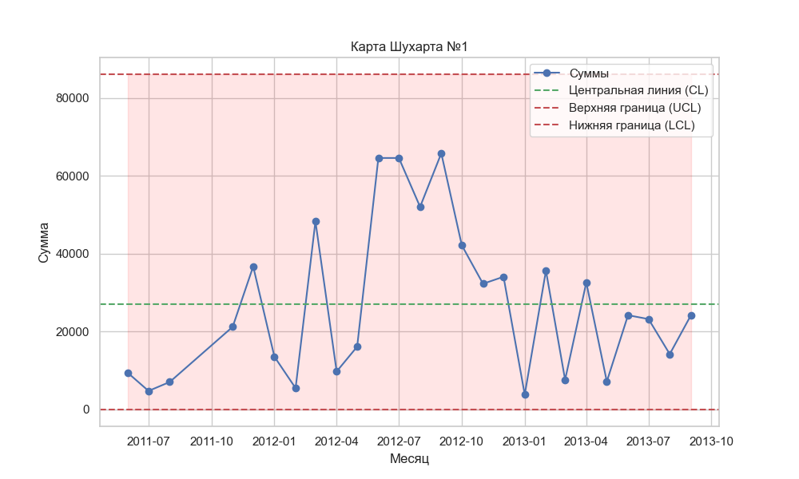
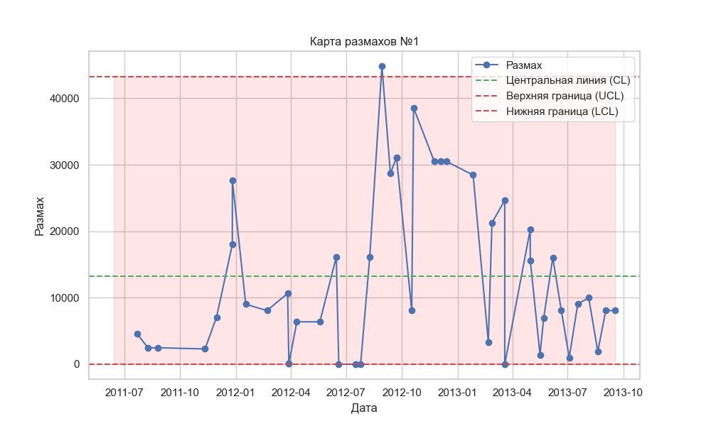
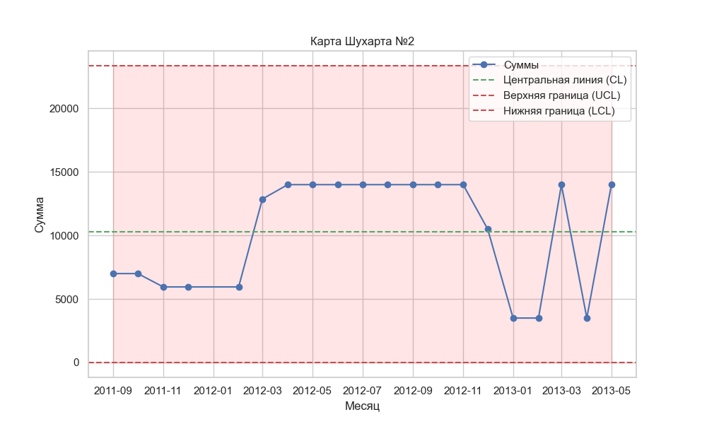
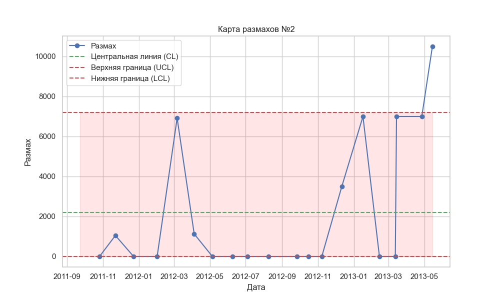
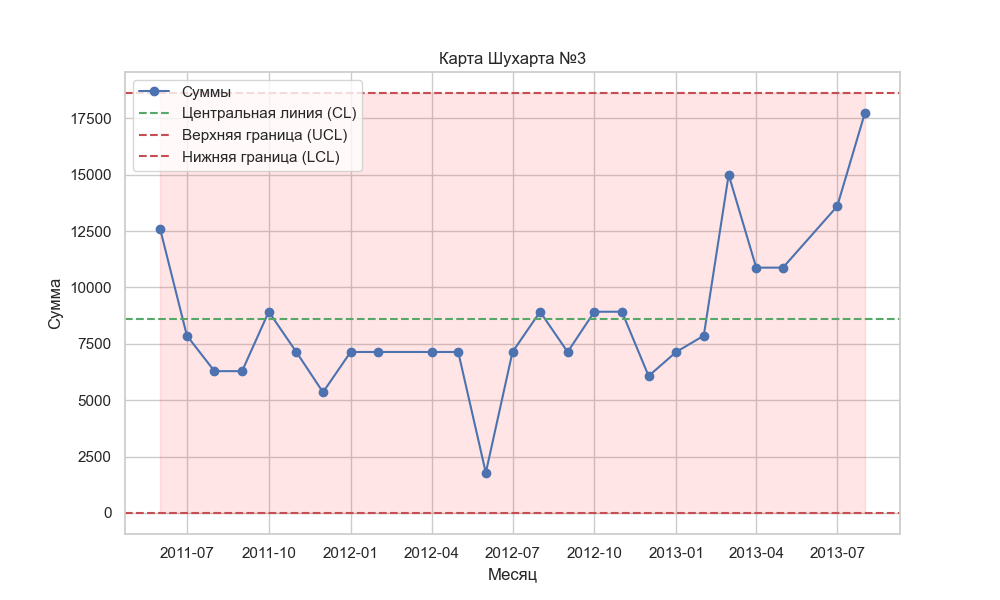
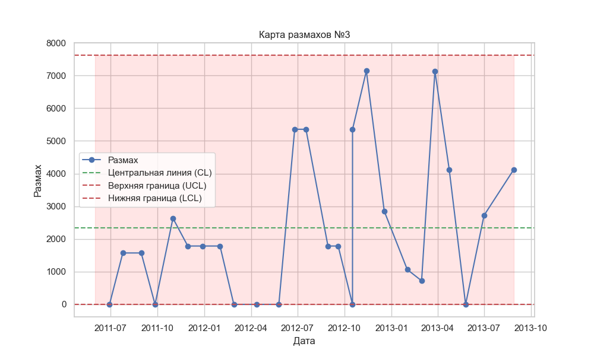
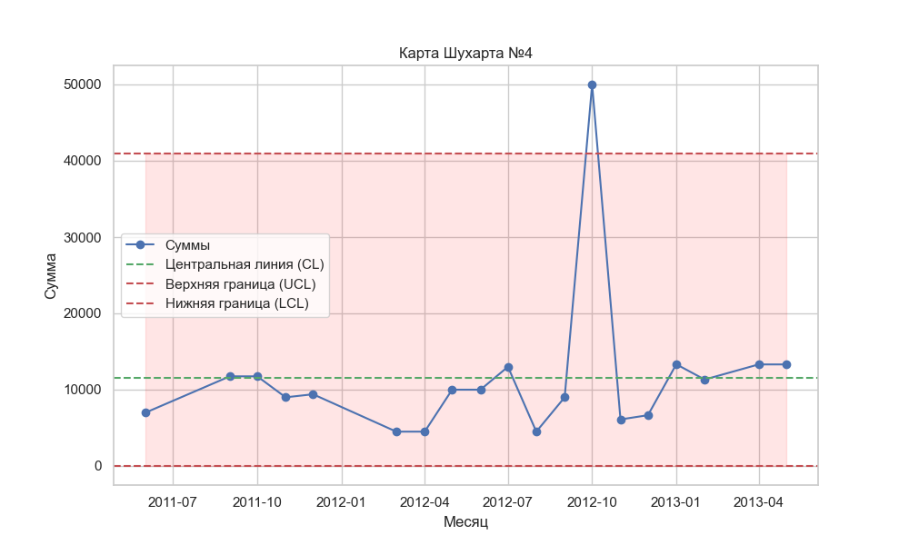
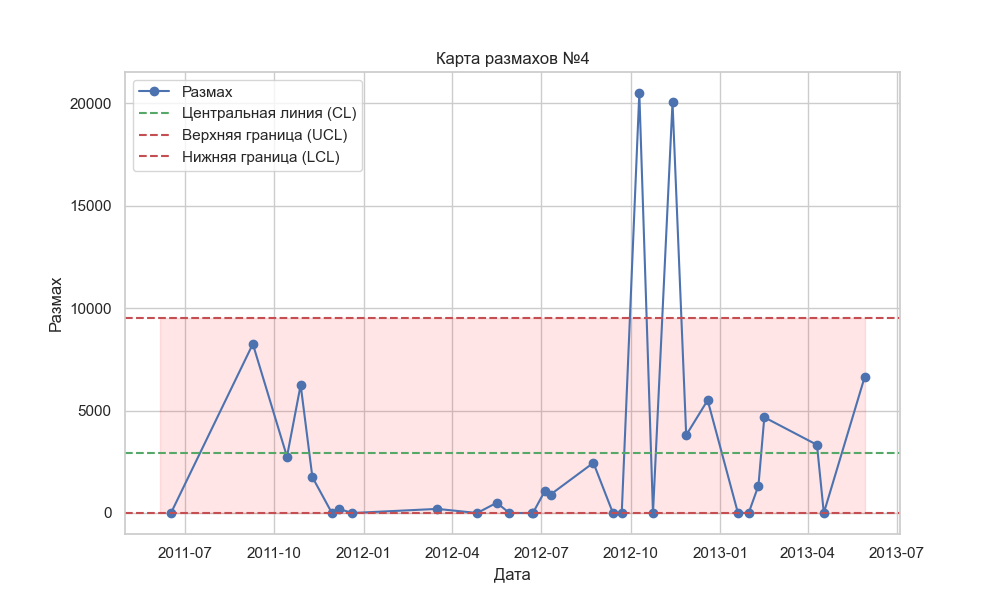

# Анализ полученных результатов

## Первая компания
| {: style="width: 300px; height: 200px;"} | {: style="width: 300px; height: 200px;"} |
|:--:|:--:|
| Все точки находятся внутри контрольных границ, что указывает на отсутствие явных сигналов о серьезных нарушениях процесса. Однако в середине графика можно наблюдать серию из 7 последовательных точек, которые расположены выше средней линии, что указывает на временное улучшение показателей (например, всплеск поступлений). После этой серии процесс возвращается к хаотичному колебанию вокруг средней линии, с большим разбросом, что говорит о высокой вариабельности процесса. | Карта размахов показывает хаотичное поведение точек относительно средней линии. Разброс между максимальными и минимальными значениями колеблется без устойчивых тенденций, что указывает на значительную изменчивость суммы поступлений в каждой выборке. При этом одно значение выходит за контрольные границы, что свидетельствует о резком увеличении вариации в одной из выборок. Это может быть признаком особого воздействия или нестабильности в процессе. |

Данная характеристика больше соответствует __проблемным__ компаниям, поскольку процесс нестабилен, поступления колеблются с большим разбросом, и одно значение выходит за пределы контроля на карте размахов. Это указывает на отсутствие систематичности и предсказуемости.

## Вторая компания
|  |  |
|:--:|:--:|
| На карте видно, что первые точки находятся примерно на одном уровне, что указывает на стабильные, но сниженные поступления на начальном этапе. Следующие показывают рост. Это может свидетельствовать о периоде стабильного увеличения поступлений. Однако после этого происходит резкий спад, что указывает на значительное ухудшение поступлений. Дальнейшие точки хаотично пересекают среднюю линию, что сигнализирует о непредсказуемости процесса на этом этапе. | Карта размахов демонстрирует колебания разброса в данных. При этом одна точка выходит за пределы контрольных границ, что свидетельствует о периодической нестабильности в вариации. |

Суммируя данные обеих карт, можно отметить, что компания испытывает явные колебания в поступлениях. На основании анализа карт компания может быть отнесена к __проблемным__. Хотя были периоды стабильного роста, наблюдаемые резкие колебания в поступлениях, а также значительные изменения вариабельности указывают на нестабильность процесса. Резкие изменения в показателях и наличие точки за пределами контрольных границ на карте размахов сигнализируют о том, что компания сталкивается с трудностями в управлении и контроле поступлений.

## Третья компания
|  |  |
|:--:|:--:|
| Все точки находятся в пределах контрольных границ, что указывает на отсутствие явных признаков выхода процесса из-под контроля. Тем не менее, данные имеют волнообразный характер, что означает регулярные колебания поступлений. Резкий рост в конце графика может свидетельствовать о значительном улучшении показателей, возможно, связанном с сезонностью, крупным контрактом или другим значимым фактором. | На карте размахов все точки также находятся в пределах контрольных границ, что указывает на стабильную вариативность процесса. Однако четко видны возрастающие пики, причем они находятся достаточно далеко от нижней границы. Это свидетельствует о том, что в некоторых периодах наблюдается увеличение разброса значений — то есть, вариативность поступлений становится больше, особенно на пиках. Пики могут свидетельствовать о том, что в процессе происходят резкие изменения, возможно, вызванные колебаниями спроса, неравномерными платежами или другими нестабильными факторами. |

Компанию можно отнести к __растущим__ с некоторыми признаками нестабильности. Волнообразный характер данных и резкий рост в конце карты Шухарта указывают на положительную динамику. Пики на карте размахов могут быть связаны с естественными колебаниями в бизнесе, такими как сезонные изменения или рост спроса.

## Четвертая компания
|  |  |
|:--:|:--:|
|  |  |