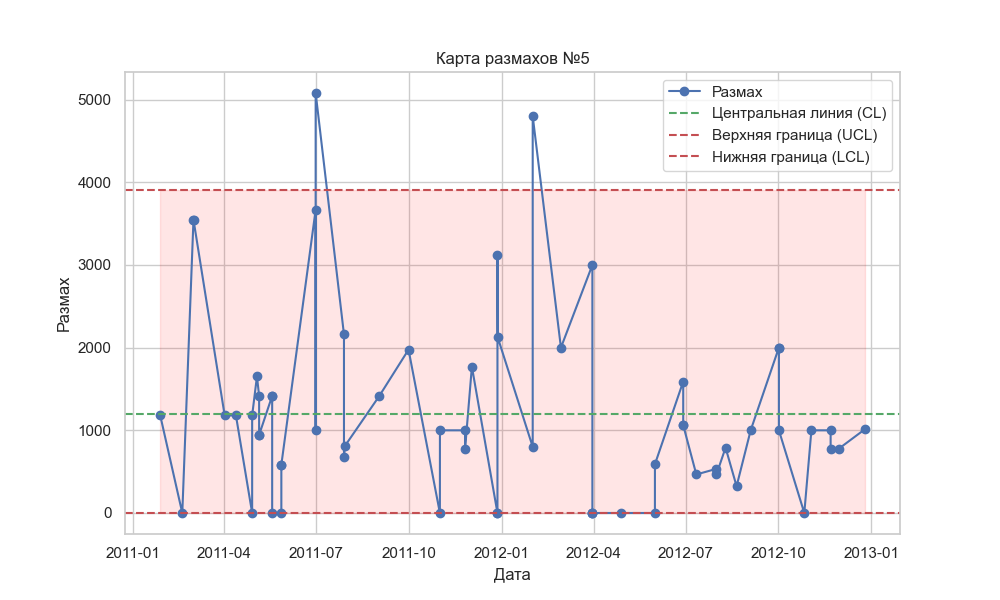
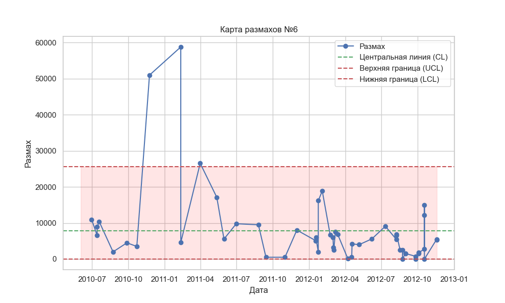

# Анализ полученных результатов

## Первая компания
|  |  |
|:--:|:--:|
| Все точки находятся в пределах контрольных границ, что указывает на отсутствие нарушений процесса. Однако в середине наблюдается 
серия из 7 точек выше средней, что может свидетельствовать о временном улучшении (всплеске поступлений). После этого процесс 
возвращается к хаотическим колебаниям вокруг средней линии с высоким разбросом, что говорит о повышенной изменчивости. | Карта размахов 
показывает хаотичное колебание точек вокруг средней линии, указывая на высокую изменчивость суммы поступлений в каждой выборке. 
Одно значение выходит за контрольные границы, что может свидетельствовать о резком увеличении вариации или нестабильности в процессе. |

Данная характеристика больше соответствует __проблемным__ компаниям, поскольку процесс нестабилен, поступления колеблются с большим 
разбросом, и одно значение выходит за пределы контроля на карте размахов. Это указывает на отсутствие систематичности и предсказуемости.

## Вторая компания
|  |  |
|:--:|:--:|
| На карте видно, что первые точки находятся примерно на одном уровне, что указывает на стабильные, но сниженные поступления на 
начальном этапе. Наблюдается рост. Это может свидетельствовать о периоде стабильного увеличения поступлений. Однако после 
этого происходит резкий спад, что указывает на значительное ухудшение поступлений. Дальнейшие точки расположены хаотично, что указывает 
на непредсказуемости процесса на этом этапе. | Карта размахов демонстрирует колебания разброса в данных. При этом одна 
точка выходит за пределы контрольных границ, что свидетельствует о периодической нестабильности в вариации. При этом достаточно много точек находятся на нижней границе. Это может показывать на стабильность поступлений, почти отсутствие колебаний в поступлениях. |

Суммируя данные обеих карт, можно отметить, что компания испытывает явные колебания в поступлениях. На основании анализа карт компания 
может быть отнесена к __лояльным__. Хотя были периоды стабильного роста, наблюдаемые резкие колебания в поступлениях, а также 
значительные изменения вариабельности указывают на нестабильность процесса. Резкие изменения в показателях и наличие точки за пределами 
контрольных границ на карте размахов сигнализируют о том, что компания сталкивается с трудностями в управлении и контроле поступлений.

## Третья компания
|  |  |
|:--:|:--:|
| Все точки находятся в пределах контрольных границ, что указывает на отсутствие явных признаков выхода процесса из-под контроля. 
Тем не менее, данные имеют волнообразный характер, что означает регулярные колебания поступлений. Резкий рост в конце графика может 
свидетельствовать о значительном улучшении показателей, возможно, связанном с сезонностью, крупным контрактом или другим значимым 
фактором. | На карте размахов все точки также находятся в пределах контрольных границ, что указывает на стабильную вариативность 
процесса. Однако четко видны возрастающие пики, причем они находятся достаточно далеко от нижней границы. Это свидетельствует о том, 
что в некоторых периодах наблюдается увеличение разброса значений. Пики могут свидетельствовать о том, что в процессе происходят резкие изменения, возможно, вызванные колебаниями спроса, неравномерными платежами или другими нестабильными факторами. |

Компанию можно отнести к __растущим__ с некоторыми признаками нестабильности. Волнообразный характер данных и резкий рост в конце карты 
Шухарта указывают на положительную динамику. Пики на карте размахов могут быть связаны с естественными колебаниями в бизнесе, такими 
как сезонные изменения или рост спроса.

## Четвертая компания
|  |  |
|:--:|:--:|
| Одна точка выходит за пределы контрольных границ. Один выброс может указывать на отдельное событие или отклонение в процессе. Это может быть разовый всплеск или падение поступлений, вызванное каким-то специфическим фактором. Так как остальные точки в пределах границ и почти все колеблются возле средней линии, то в общем процесс стабилен. | Два выброса на карте размахов указывают на повышенную изменчивость в некоторых выборках. Это может свидетельствовать о нестабильности процесса в определенные периоды, когда вариации между минимальными и максимальными значениями сильно увеличиваются. Возможные причины — колебания спроса, нестабильность поставок, ошибки в учете или другие внешние факторы, влияющие на процесс. |

Компанию можно отнести к __проблемным__, поскольку такие показатели не характерны для устойчевого роста или стабильных поступлений.  Это может быть вызвано нерегулярными платежами от клиентов, нестабильный спрос или внутренние проблемы с операционной эффективностью.

## Пятая компания
|  |  |
|:--:|:--:|
| Ситуация похожа на ту, что наблюдалась у четвертой компании. Также можно предположить, что процесс стабилен, так как остальные точки в пределах границ и почти все колеблются возле средней линии. | Два выброса на карте размахов указывают на повышенную изменчивость в некоторых выборках. В целом можно отметить высокую изменчивость и непредсказуемость данных. |

Компанию можно отнести к __проблемным__, поскольку карта размахов показывает значительные колебания в диапазоне значений, что может указывать на временные нарушения стабильности процесса. 

## Шестая компания
|  |  |
|:--:|:--:|
| Все точки находятся в пределах контрольных границ, что указывает на отсутствие явных признаков выхода процесса из-под контроля. В целом компания показывает стабильность поспуплений с повышенными поступлениями к концу графика. Но так как показатели находятся в пределах границ можно сказать, что он относительно стабилен. | На карте размахов наблюдаются выборосы в начале процесса. Это может быть связано с расширением компании или запуском новых продуктов. Так как далее компания показывает низкую вариативность в данных, можно говорить о некоторой стабильности процесса. |

На основании анализа карт компания может быть отнесена к __лояльным__.